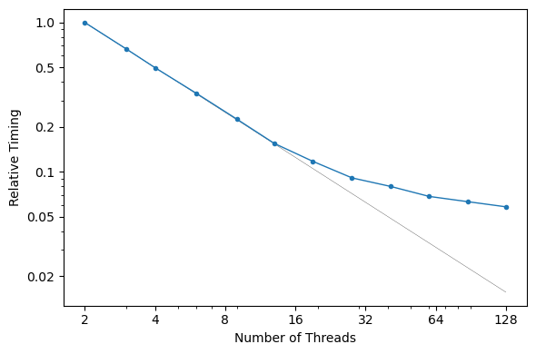

# MARS

A C++ implementation of [Multivariate Adaptive Regression Splines](https://w.wiki/GVPL).
This is a semi-brute force search for interactions and non-linearities. It will
provide competitive regression performance compared to neural network for, but
with much faster model evaluation runtimes.

References:

* [Write-up describing the method](https://uc-r.github.io/mars)
* [Commercial MARS package](https://www.salford-systems.com/products/mars) by Salford Systems
* [R "earth" package documentation](https://cran.r-project.org/web/packages/earth/earth.pdf)
* [Stephen Milborrow's resource page](http://www.milbo.users.sonic.net/earth)
* Additionally, there is a scikit-learn module [here](https://contrib.scikit-learn.org/py-earth)

## Performance

We use [OpenMP](https://www.openmp.org) to achieve good speed-up per core. There
is some memory overhead for each thread launched, which might constrain the total
number of cores available. You can control the number of threads via the
`OMP_NUM_THREADS` environment variable or the `threads` argument.

The following timings were obtained on an AMD EPYC 9654 96-Core Processor with
192 logical CPUs. Note that multi-threaded performance is nearly ideal up to 30
cores or so.



## Supported Platforms

These instructions have been verified to work on the following platforms:

* Ubuntu 18.04 through 24.04
* Raspbian 10
* macOS High Sierra (10.13) through Tahoe (26.4)

## Build Requirements

* [Eigen](http://eigen.tuxfamily.org/) - The code has been tested with version 3.3.4.
* [GoogleTest](https://github.com/google/googletest)

```bash
sudo apt install -y libeigen3-dev libgtest-dev
```
... on macOS:
```bash
brew install pkg-config eigen googletest
```

On older Ubuntu versions (before 22.04) you'll need to [build from source](https://bit.ly/2vNUBWN):

```bash
sudo apt install -y libgtest-dev cmake
cd /usr/src/gtest
sudo cmake . && sudo make
sudo cp lib/*.a /usr/lib
```

[pybind11](https://github.com/pybind/pybind11):

```bash
pip3 install pybind11
```

## Build Instructions

Use the Makefile:

```bash
cd mars
make
make test # optional - build and run the unit tests
```

Or install directly via pip:

```bash
cd mars
pip install .
```

## An Example

Here we train a linear model with a categorical interaction.

```python
import numpy as np
X      = np.random.randn(10000, 2)
X[:,1] = np.random.binomial(1, .5, size=len(X))
y      = 2*X[:,0] + 3*X[:,1] + X[:,0]*X[:,1] + np.random.randn(len(X))

# convert to column-major float
X = np.array(X, order='F', dtype='f')
y = np.array(y, dtype='f')

# Fit the model
import mars
model = mars.fit(X, y, max_epochs=8, tail_span=0, linear_only=True)
B     = mars.expand(X, model) # expand the basis
beta  = np.linalg.lstsq(B, y, rcond=None)[0]
y_hat = B @ beta

# Pretty-print the model
mars.pprint(model, beta)
```

Depending on the random seed, the result should look similar to this:

```
  -0.003
  +1.972 * X[0]
  +3.001 * X[1]
  +1.048 * X[0] * X[1]
```
